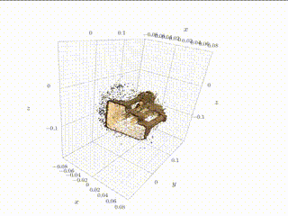

# Perception Projects
This is my repository of Machine Perception Projects from the [CIS 5800: Machine Perception](https://sites.google.com/seas.upenn.edu/cis580spr23#h.p_EqXqxHg7HQdq) taught by Dr. Kostas Danilidis. 
You can check out the following projects in this repository.

## Virtual Billboard

## Virtual Reality Rendering

## Stereo Vision 

## Neural Radiance Field

